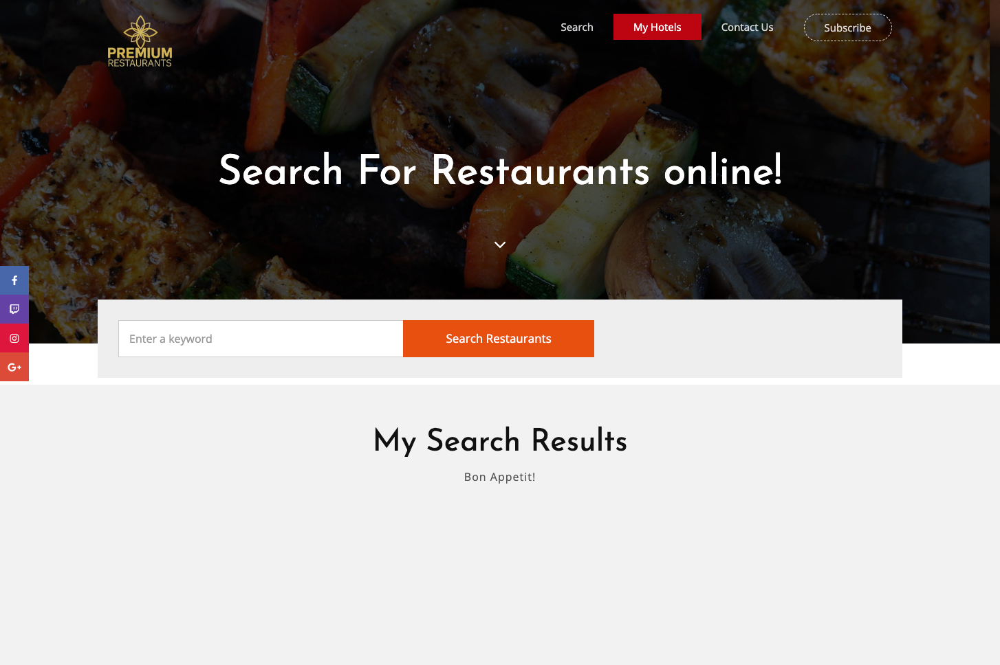
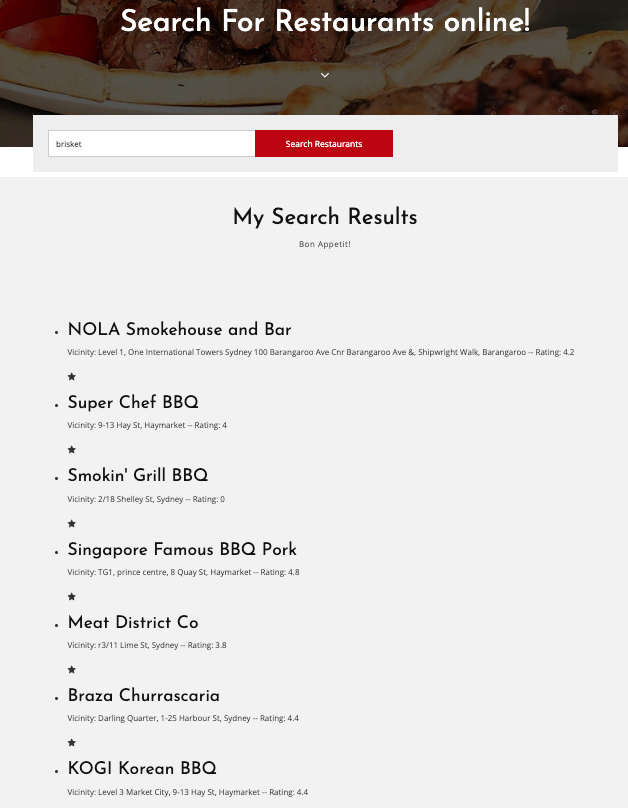

# Premium-Restaurants-Listing
Our website's purpose is to provide our user a list of nearby restaurants according to the user's "craving" of the day. For instance, if we put in "chicken," all nearby restaurants related to chicken will appear in our website. 

## User Story
* AS A frequent traveler;
* I WANT to search for Premium Restaurants near my destination;
* SO THAT I can dine out according to my “cravings” wherever I go.

## Acceptance Criteria
* WHEN I enter Premium Restaurants;
* THEN I am able to insert my keyword and see a list of restaurants;
* WHEN I really like a specific restaurant;
* THEN I click on the star and can add it to my favorites list.

## Folder Structure

### readme.md
Succinct display of team progress/project overview.

### css
* style.css - team members' custom stylistic modification of the website on top of below files: 
  * bootstrap.min.css - known as the "minified version of" bootstrap.css and provides clean/basic grids in our website;
  * font-awesome.css - provides our website with vector icons such as the star button;
  * owl.carousel.min.css - provides our website with the carousel sliders shown in our header;
  *  slick.css - provides our website with the sliders shown in our header as well.

### js
* script2.js - main script which incorporates functions derived from google developer guides followed by class material;
  * script.js - script.js is a mere sample script copied and pasted from Google's Neighborhood Discovery for reference;
  * jquery.min.js - "compressed version" of jquery.js;
  * bootstrap.min.js - "minified version" of bootstrap.js;
  * owl.carousel.min.js - related to the banner slideshow;
  * slick.min.js - related to the banner slideshow;
  * interface.js - N/A;
  * config.js - N/A;

### images
All images necessary for website and readme preview stored here.

### html
* index.html is our main html and works as seen below:
  * Entrance Screenshot

  * Search Results Screenshot

* google.html - sample html from Google's Neighborhood discovery and is used for reference only.
  
## Link
* <a href="https://trebligony.github.io/Premium-Restaurants-Listing/">Premium Restaurants Listing</a>
*  Allow CORS, the url will be deployed.

